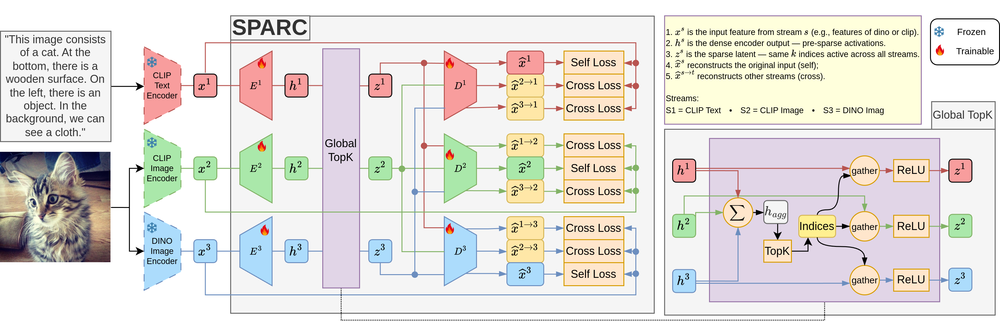

# SPARC: Concept-Aligned Sparse Autoencoders for Cross-Model and Cross-Modal Interpretability
[📊 Slides](docs/SPARC_Slides.pdf)

**SPARC** (**Sp**arse Autoencoders for **A**ligned **R**epresentation of **C**oncepts) learns a unified latent space shared across diverse models (DINO, CLIP Vision, CLIP Text) where individual dimensions correspond to the same concepts across different architectures and modalities. This enables cross-model interpretability, allowing you to understand what concepts are being captured consistently across different vision and vision-language models.

## Installation

```bash
git clone https://github.com/AtlasAnalyticsLab/SPARC.git
cd SPARC
pip install -e .
```

## Architecture



The SPARC architecture processes multiple input streams (CLIP Text, CLIP Image, DINO Image) through stream-specific encoders and decoders, coupled by a shared sparse activation mechanism that promotes concept alignment.

**Key Components:**
- **Stream Encoders**: Transform input features x^s into pre-activation logits h^s through affine transformations
- **Global TopK**: Aggregates logits across all streams, selects top-k indices globally, then applies the same indices to create sparse representations z^s for each stream
- **Stream Decoders**: Reconstruct original features from sparse latents using stream-specific linear transformations

The Global TopK mechanism ensures identical TopK selection across all streams for each sample, enforcing structural sparsity and cross-modal alignment. However, this only constrains which latents are selected, not their activations or semantic content. Cross-reconstruction loss is therefore essential to ensure individual latents encode similar concepts across modalities.
## Feature Extraction

### Option 1: Download Pre-computed Features

Download pre-extracted features and trained models:

**[Download Features & Results](https://drive.google.com/drive/folders/1DRvYml0rF5ZRpwCVpdDvVoI8TiU4aUzl)**

Contains:
- `features/` - Pre-extracted DINO and CLIP features for Open Images and COCO
- `final_results/` - Pre-trained SPARC model weights and analysis results

### Option 2: Extract Your Own Features

#### COCO Dataset
```bash
# Extract both DINO and CLIP features for COCO validation set
python sparc/feature_extract/extract_coco.py \
    --split val \
    --data_root ./dataset/COCO \
    --output_dir_base ./features/coco \
    --extract_dino --extract_clip

# Extract only DINO features with custom model
python sparc/feature_extract/extract_coco.py \
    --split train \
    --dino_model dinov2_vitl14_reg \
    --batch_size 64 \
    --extract_dino
```

#### Open Images Dataset
```bash
# Extract features for training split  
python sparc/feature_extract/extract_open_images.py --model clip --split train

# Extract features for test split
python sparc/feature_extract/extract_open_images.py --model dinov2 --split test
```
Do the same for other splits and models. 

## Running SPARC Training and Evaluation

### Training SPARC Models
```bash
# Train SPARC model with global TopK on COCO
python main.py \
    --config configs/config_coco.json \
    --topk_type global \
    --n_latents 8192 \
    --k 64 \
    --cross_loss_coef 1.0

# Train with local TopK (per-modality)
python main.py \
    --config configs/config_coco.json \
    --topk_type local \
    --n_latents 16384 \
    --k 128
```

### Evaluation Only
```bash
# Run evaluation with pre-trained COCO model (runs both classification and retrieval)
python main.py --config configs/config_coco.json --only_eval

# Run evaluation with pre-trained Open Images model  
python main.py --config configs/config_open_images.json --only_eval
```

### Key Parameters
- `--topk_type`: `global` (shared concepts) or `local` (per-modality concepts)
- `--n_latents`: Number of latent dimensions (typically 8192-16384)
- `--k`: Number of active latents per sample (sparsity level)
- `--cross_loss_coef`: Weight for cross-modal alignment loss

## Notebooks and Analysis
To ensure that the notebooks are running, download the model weights from **[Download Features & Results](https://drive.google.com/drive/folders/1DRvYml0rF5ZRpwCVpdDvVoI8TiU4aUzl)**.


### Qualitative Analysis

**`notebooks/qual/t1_visualize_dim.ipynb`**
- Use this notebook to visualize individual latent dimensions across different configurations (Global TopK vs Local).
- See example results in [VISUALIZATIONS](VISUALIZATIONS.md)

**`notebooks/qual/t2_aligned_concept_visualization.ipynb`**
- This notebook generates heatmaps/attribution scores for both image and text modalities based on individual or a set of concept-specific latents.
- See example results in [VISUALIZATIONS](VISUALIZATIONS.md) 

**`notebooks/qual/t3_heatmaps_from_caption.ipynb`**
- This notebook generates heatmaps/attribution scores for both image and text modalities based on similarity of shared latents for each modality to the other.
- See example results in [VISUALIZATIONS](VISUALIZATIONS.md)  

**`notebooks/qual/scripts_all_results/t1_latent_visualizations_open.py`**
- Latent visualization script specifically for Open Images dataset
- Batch processing for generating latent activation visualizations

**`notebooks/qual/scripts_all_results/t2_concept_batch_visualization.py`**
- Batch processing script for concept visualization across multiple images

**`notebooks/qual/scripts_all_results/t3_caption_visualization.py`**
- Batch processing multiple text inputs to generate corresponding visual attributions

**`notebooks/qual/t456_retrieval.ipynb`**
- Retrieval analysis and evaluation using SPARC latents for in-distribution tasks (meaning each sample is guaranteed to have a corresponding pair) on test set of Open Images

**`notebooks/qual/t789_retrieval_ood.ipynb`**
- Out-of-distribution retrieval analysis

### Quantitative Analysis
**`notebooks/quant/t1_jaccard_dead_latents.ipynb`**
- Jaccard similarity analysis between latent activations
- Dead latent calculation and analysis across different configurations

**`notebooks/quant/t2_probe_1d.ipynb`**
- 1D linear probing analysis on SPARC latents
- Evaluates interpretability and linear separability of learned concepts


**`notebooks/quant/t3_segmentation-coco-latents-global.ipynb`**
- Semantic segmentation evaluation using Global TopK SPARC latents

**`notebooks/quant/t3_segmentation-coco-latents-local.ipynb`**
- Semantic segmentation evaluation using Local TopK SPARC latents

**`notebooks/quant/t3_segmentation-coco-caption.ipynb`**
- Caption-based segmentation evaluation
- Tests cross-modal concept transfer from text to visual segmentation
- Validates that text-derived concepts can localize visual regions

**`notebooks/quant/t3_segmentation-coco-DETR.ipynb`**
- DETR-based segmentation as a baseline for evaluation


**`notebooks/quant/t4_retrieval_clip_baseline.ipynb`**
- CLIP baseline comparison for retrieval tasks

For comprehensive visualization examples and results from all notebooks, see **[VISUALIZATIONS](VISUALIZATIONS.md)**.

## Citation

```bibtex
@misc{nasirisarvi2025sparcconceptalignedsparseautoencoders,
      title={SPARC: Concept-Aligned Sparse Autoencoders for Cross-Model and Cross-Modal Interpretability}, 
      author={Ali Nasiri-Sarvi and Hassan Rivaz and Mahdi S. Hosseini},
      year={2025},
      eprint={2507.06265},
      archivePrefix={arXiv},
      primaryClass={cs.CV},
      url={https://arxiv.org/abs/2507.06265}, 
}
```

## Contact

- GitHub: [AtlasAnalyticsLab/SPARC](https://github.com/AtlasAnalyticsLab/SPARC)
- Email: ali.nasirisarvi@mail.concordia.ca
